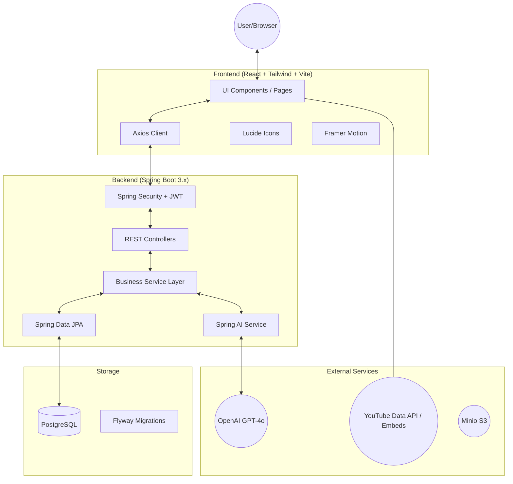
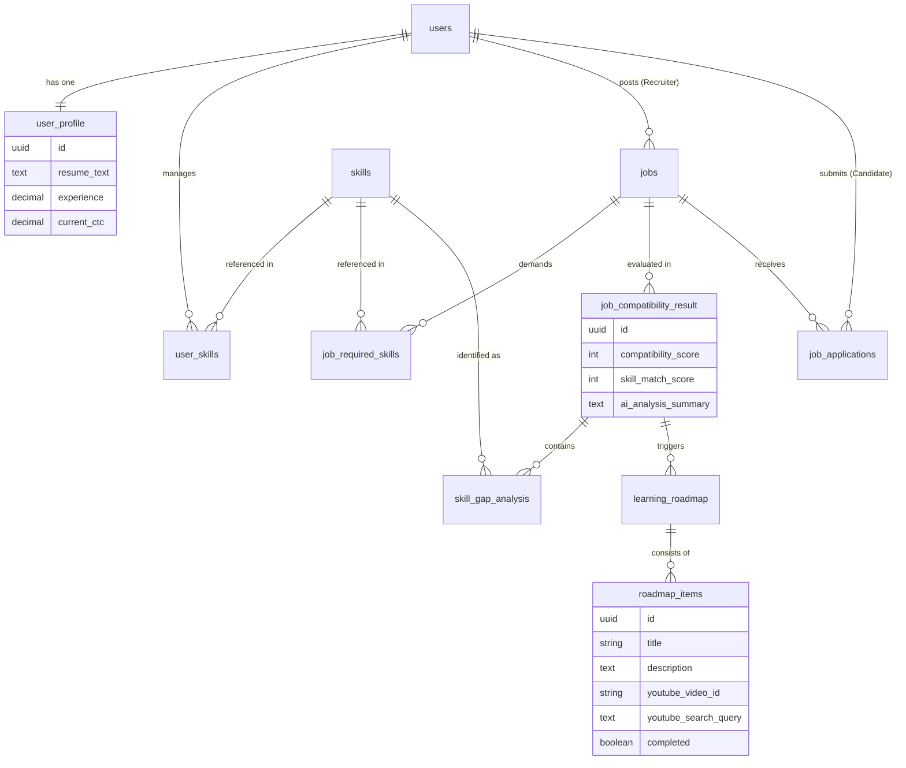

# CareerGate - Design Document

CareerGate is an AI-powered job compatibility and skill gap analysis platform. It helps candidates understand how well they fit a job role, identifies their missing skills, and provides a personalized learning roadmap to bridge those gaps.

---

## 1. System Architecture

The application follows a modern decoupled architecture with a React-based frontend and a Java Spring Boot backend, integrated with OpenAI via Spring AI.

### Tech Stack Details:
- **Frontend**: React 18, TypeScript, Tailwind CSS, Framer Motion (Animations), Lucide React (Icons).
- **Backend**: Java 21, Spring Boot 3.2.2, Spring AI (1.0.0-M5), Spring Security.
- **Database**: PostgreSQL (Relational storage and Vector support for potential embedding features).
- **AI**: OpenAI Chat Completions for resume analysis and roadmap generation.

---

## 2. Entity Relationship (ER) Diagram

The database schema is designed to handle users, their modular skills, job requirements, and the complex results of AI analysis.

---

## 3. User Flows

### A. Candidate Experience Flow
1. **Onboarding**: User creates an account as a "Candidate" and uploads their resume.
2. **Profile Setup**: Candidate adds their self-reported skills and ratings.
3. **Job Discovery**: Candidate browses the job list.
4. **Compatibility Check**:
    - Candidate clicks "Check Compatibility".
    - Backend parses resume text + profile skills.
    - AI analyzes resume against Job Description.
    - Result: Compatibility Score, Gauge Charts, and Specific Skill Gaps.
5. **Upskilling**:
    - Candidate clicks "Generate Roadmap" for gaps.
    - AI generates a day-by-day learning plan.
    - Candidate watches embedded YouTube tutorials and reads linked documentation.
6. **Application**: Candidate applies for the job once confident.

### B. Recruiter Experience Flow
1. **Job Management**: Recruiter posts a new job with specific title, description, and required skill ratings.
2. **Applicant Tracking**:
    - Recruiter views a list of applicants for their jobs.
    - Recruiter can see the AI-generated compatibility scores for each candidate instantly.
    - Simplifies filtering hundreds of resumes.

---

## 4. Engineering Highlights

- **AI Prompt Engineering**: Used a multi-layered prompt with a pre-defined "Verified Knowledge Base" to prevent LLM hallucinations for YouTube links.
- **AI Observability**: Integrated `SimpleLoggerAdvisor` to monitor raw AI inputs and outputs for debugging and refining prompt performance.
- **Fuzzy Skill Matching**: Implemented a custom word-boundary and substring matching logic to correctly identify technologies (e.g., distinguishing Java from JavaScript).
- **Dynamic UI**: Responsive dashboard with glassmorphism design, animated progress tracking, and interactive skill gap visualizations.
- **Secure Architecture**: JWT-based stateless authentication with role-based access control (RBAC).
