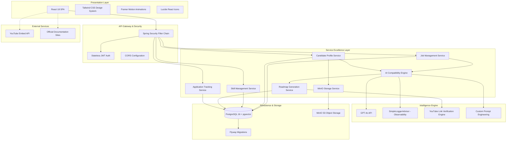
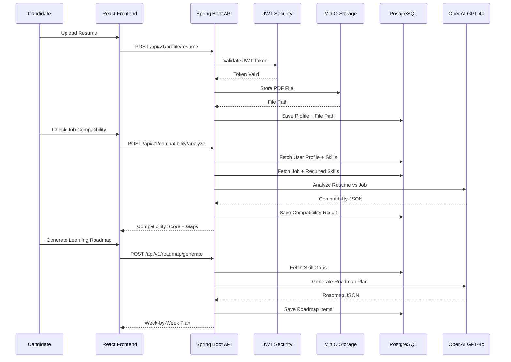
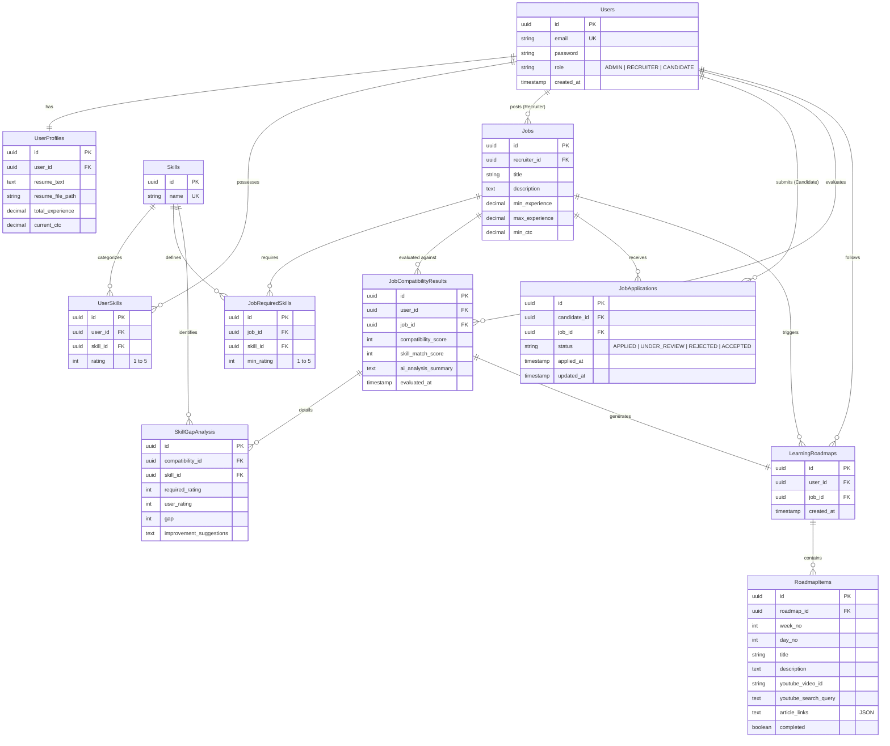

# CareerGate: Enterprise AI Recruitment & Upskilling Platform
## System Design & Architecture Specification v1.0

---

## 1. Executive Summary
CareerGate is a next-generation Career Intelligence platform designed to bridge the widening gap between industry requirements and candidate skills. By leveraging Large Language Models (LLMs) and Vector-based skill mapping, CareerGate automates the process of compatibility analysis, resume parsing, and personalized learning path generation.

---

## 2. Problem Statement & Pain Points

### 2.1 The Recruiter’s Challenge
- **Resume Overload**: Recruiters receive hundreds of resumes per job post, often with 80% being irrelevant.
- **Surface-Level Keyword Matching**: Traditional ATS (Applicant Tracking Systems) rely on simple keyword matching, missing candidates with equivalent alternative skills.
- **Subjectivity**: Manual screening is prone to bias and inconsistent evaluation of skill proficiency.

### 2.2 The Candidate’s Challenge
- **The "Black Hole" Effect**: Candidates apply for jobs and never receive feedback on why they were rejected.
- **Skill Ambiguity**: Candidates often don't know exactly which skill they are missing for a specific role.
- **Fragmented Learning**: Even when a gap is identified, finding high-quality, relevant resources (videos/docs) is a time-consuming task.

---

## 3. The CareerGate Solution
CareerGate solves these problems by providing an **AI-Driven Feedback Loop**:
1. **Semantic Analysis**: Goes beyond keywords to understand the *context* of experience using LLMs.
2. **Quantified Compatibility**: Provides a weighted score (0-100) based on multiple vectors:
    - **Skill Match**: Gap between required vs. possessed skills.
    - **Experience Match**: Depth of years vs. seniority required.
    - **Resume Quality**: Formatting, clarity, and relevance.
3. **Automated Upskilling**: Automatically generates a time-bound learning roadmap with verified resources for every identified gap.

---

## 4. Feature Specification

### 4.1 User Authentication & Role-Based Access Control (RBAC)
- **Description**: Secure JWT-based stateless authentication with three distinct user roles: ADMIN, RECRUITER, and CANDIDATE.
- **Technical Implementation**: Spring Security with custom JWT filter chain, BCrypt password hashing.
- **Example**: A recruiter can only view and manage their own job postings, while candidates can only apply for jobs and view their own compatibility results.

### 4.2 User Profile Management
- **Description**: Comprehensive profile management system allowing candidates to maintain their professional information.
- **Features**:
  - Resume upload and parsing (PDF/DOCX support via Apache Tika)
  - Self-reported skill ratings (1-5 scale)
  - Experience tracking (total years)
  - Compensation expectations (current CTC, expected CTC)
  - Notice period management
- **Example**: A candidate uploads their resume, and the system automatically extracts text for AI analysis while storing the original file in Minio S3 for future reference.

### 4.3 MinIO S3-Compatible Object Storage
- **Description**: Enterprise-grade distributed object storage for resume files and documents.
- **Technical Implementation**: 
  - MinIO server integration with Spring Boot
  - Automatic bucket creation and management
  - Secure file upload/download with presigned URLs
  - File metadata tracking in PostgreSQL
- **Benefits**:
  - Scalable storage independent of database
  - Cost-effective compared to cloud storage
  - Self-hosted data sovereignty
- **Example**: When a candidate uploads a 2MB PDF resume, it's stored in MinIO bucket `careergate-resumes` with a unique UUID filename, while the database stores only the reference path.

### 4.4 Job Posting & Management
- **Description**: Full-featured job posting system for recruiters with granular skill requirements.
- **Features**:
  - Rich text job descriptions
  - Multiple skill requirements with minimum rating thresholds
  - Experience range specification (min/max years)
  - Compensation range (min/max CTC)
  - Company name and location
  - Edit and delete capabilities
- **Technical Implementation**: 
  - Transactional job updates with orphan removal for skill changes
  - Unique constraint handling for job-skill combinations
  - Cascading deletes for data integrity
- **Example**: A recruiter posts a "Senior Java Developer" role requiring Java (min rating 4), Spring Boot (min rating 3), and Docker (min rating 2), with 5-8 years experience and 15-25 LPA compensation.

### 4.5 Interactive Dashboard (Candidate)
- **Description**: Personalized dashboard showing job compatibility scores, skill gaps, and learning progress.
- **Features**:
  - Job listing with real-time compatibility scores
  - Visual skill gap analysis with gauge charts
  - Learning roadmap progress tracking
  - Application status monitoring
- **UI/UX**: Glassmorphism design with Framer Motion animations, responsive layout, dark mode support.
- **Example**: A candidate sees their dashboard showing 85% compatibility with a job, with visual indicators for 3 skill gaps and a 2-week learning roadmap in progress.

### 4.6 Interactive Dashboard (Recruiter)
- **Description**: Recruiter-focused dashboard for managing job posts and viewing applicants.
- **Features**:
  - Job post management (create, edit, delete)
  - Applicant tracking with AI-generated compatibility scores
  - Bulk applicant filtering and sorting
  - Application status updates
- **Example**: A recruiter views 47 applications for a job, sorted by compatibility score (highest first), and can instantly see that the top candidate has a 92% match with only 1 minor skill gap.

### 4.7 Precision Resume Analysis
- **Description**: AI-powered resume parsing and semantic analysis using GPT-4o.
- **Technical Implementation**:
  - Apache Tika for text extraction from PDF/DOCX
  - Spring AI ChatClient with SimpleLoggerAdvisor for observability
  - Custom prompt engineering for structured JSON responses
- **Analysis Dimensions**:
  - Skill matching (weighted by rating requirements)
  - Experience alignment (years and relevance)
  - Resume quality (formatting, clarity, completeness)
- **Example**: If a job asks for "Cloud Infrastructure" and a resume lists "AWS EC2/S3" and "Terraform", the AI identifies a 95% match despite the different terminology, understanding that Terraform is an Infrastructure-as-Code tool relevant to cloud infrastructure.

### 4.8 Interactive Skill Gap Analysis
- **Description**: Visual dashboard showing the "Required" vs "Actual" rating for each skill with actionable improvement suggestions.
- **Features**:
  - Color-coded gap severity (green: no gap, yellow: minor, red: critical)
  - AI-generated improvement suggestions (2-3 lines per skill)
  - Gap level calculation (1-5 scale)
  - Filtering to show only skills where user rating < required rating
- **Example**: A job requires Java (Rating 4). A candidate has Java (Rating 2). The system identifies a "Gap of 2" and tags it as "Critical" with the suggestion: "Focus on advanced Java concepts like multithreading, JVM internals, and design patterns. Practice building production-grade applications."

### 4.9 AI-Generated Learning Roadmaps
- **Description**: Personalized, time-bound learning plans with curated resources.
- **Features**:
  - Week-by-week, day-by-day structured curriculum
  - Verified YouTube video IDs from top educational channels
  - Fallback YouTube search queries for niche topics
  - Official documentation links (MDN, Spring.io, etc.)
  - Progress tracking with completion checkboxes
  - Embedded video player with fallback search
- **Technical Implementation**:
  - Custom YouTube video verification service with 25+ pre-verified IDs
  - Fuzzy matching algorithm to distinguish Java vs JavaScript
  - JSON storage for article links array
- **Example**: For a "Docker" gap, the roadmap includes:
  - **Week 1, Day 1**: "Docker Architecture Fundamentals"
    - Video: `pTJxdL_pIWM` (Docker Tutorial - Programming with Mosh)
    - Search Query: "Docker tutorial complete guide Programming with Mosh"
    - Articles: [Docker Official Docs](https://docs.docker.com), [Docker Best Practices](https://docs.docker.com/develop/dev-best-practices/)

### 4.10 Job Application Management
- **Description**: Streamlined application process with duplicate prevention and status tracking.
- **Features**:
  - One-click application submission
  - Duplicate application prevention (backend validation)
  - Application status indicators (Applied, Under Review, Rejected, Accepted)
  - Application history for candidates
  - Applicant list for recruiters with compatibility scores
- **Example**: A candidate clicks "Apply for Job" and the button immediately changes to "Applied Successfully" with a green checkmark, preventing accidental duplicate applications.

### 4.11 AI Observability & Logging
- **Description**: Full transparency into AI decision-making with request/response logging.
- **Technical Implementation**: Spring AI SimpleLoggerAdvisor integration
- **Benefits**:
  - Debug AI hallucinations or incorrect responses
  - Monitor token usage and costs
  - Audit trail for compliance
  - Prompt refinement based on actual outputs
- **Example**: Server logs show the exact prompt sent to GPT-4o for a compatibility analysis and the raw JSON response, allowing developers to identify if the AI is correctly following instructions.

---

## 5. System Architecture

### 5.1 High-Level Design (HLD)
CareerGate utilizes a **Layered Micro-Service Architecture** designed for scalability and high availability.

### 5.2 Data Flow Architecture

---

## 6. Detailed Data Model (ER Diagram)

The schema enforces data integrity while supporting flexible AI-generated content.

---

## 7. Future Roadmap & Enhancements

### 7.1 Integrated Interview Simulation
- AI-driven peer-coding sessions.
- Sentiment analysis on candidate confidence during mock interviews.

### 7.2 Vector-Based Search (RAG)
- Implementing `pgvector` to allow recruiters to search for candidates by "Natural Language" (e.g., "Find me someone who knows Java but has worked on high-scale FinTech").

### 7.3 Multi-Modal Analysis
- Processing candidate intro videos to assess soft skills and communication.

---

## 8. Conclusion
CareerGate is not just a tool; it is an ecosystem. By combining the precision of automated analysis with the empathy of personalized growth plans, it creates a win-win scenario for the modern workforce.

---
**Prepared by**: CareerGate Core Engineering Team
**Date**: February 10, 2026
